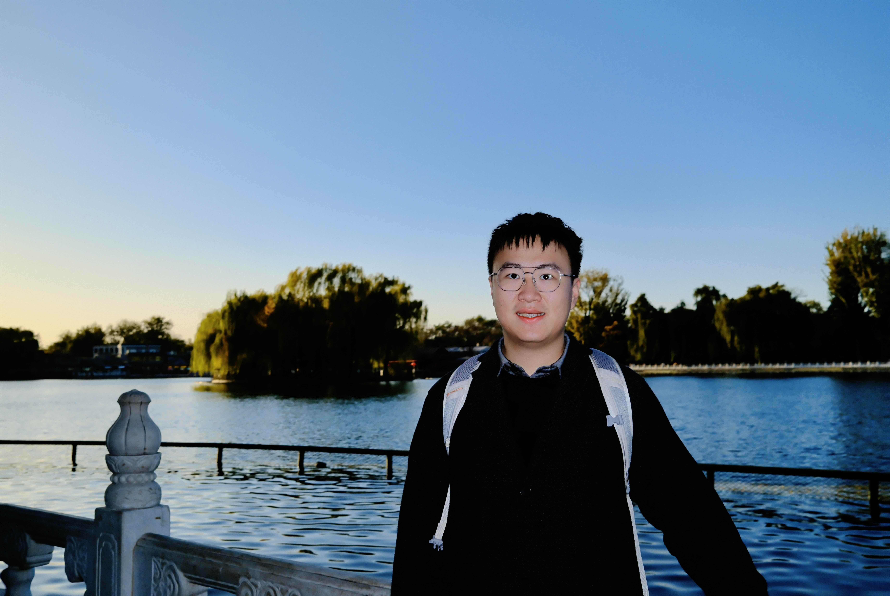

# Shaowen Wang (Shawn)

My name is **Shaowen Wang**, and I am currently a Ph.D. student in Computer Science at **Tsinghua University**, advised by [Prof. Jian Li](https://people.iiis.tsinghua.edu.cn/~jianli/). I received my B.S. degree in Computer Science from **Fudan University** (Rank 1/110).

## 💫Research Interest
My research aims to answer two fundamental questions about Large Language Models:

- **How can we build more data-efficient learners?** I explore novel architectures and optimization techniques to improve sample efficiency. The goal is to push the boundaries of how much knowledge a model can extract from limited data budgets while maintaining computational efficiency.

- **How do models actually learn from data?** I study the physics of learning inside LLMs. This involves dissecting the relationship between data distribution and model behaviors—analyzing the order of knowledge acquisition, the duality between compression and prediction, and how data artifacts (like spurious correlations) fundamentally constrain model capacity and cause hallucinations.

---

## 📝 Publications

**AdaRope: Adaptive Rotary Position Embeddings for Long-Context Transformers**
*Working Paper (2025)*
> Proposed **AdaRope**, a drop-in replacement for RoPE that utilizes learnable per-head frequencies (DimRope) and length-aware scaling (AdaScale). It significantly outperforms Yarn and ABF in both pre-training and long-context extrapolation with negligible parameter overhead.

**[When Bias Pretends to Be Truth: How Spurious Correlations Undermine Hallucination Detection in LLMs](https://arxiv.org/abs/2511.07318)**
*Working Paper / Under Review (2025)*
> Identified a critical class of hallucinations driven by spurious correlations that are immune to model scaling and evade existing detection methods.

**[Understanding LLM Behaviors via Compression: Data Generation, Knowledge Acquisition and Scaling Laws](https://arxiv.org/abs/2504.09597)**
**NeurIPS 2025**
> Established a unified information-theoretic framework (Syntax-Knowledge model) to explain scaling laws and hallucination mechanisms by connecting compression and prediction.

**[CAdam: Confidence-Based Optimization for Online Learning](https://arxiv.org/abs/2411.19647)**
*Preprint (2024)*
> Proposed a confidence-based optimizer that selectively updates parameters based on momentum-gradient consistency, showing superior noise robustness.

**[LoRA-GA: Low-Rank Adaptation with Gradient Approximation](https://arxiv.org/abs/2407.05000)**
**NeurIPS 2024, Merged into Huggingface/peft**
> Introduced a novel initialization method aligning low-rank gradients with full fine-tuning, accelerating convergence by 2-4x.

**[Generative Table Pre-training Empowers Models for Tabular Prediction](https://arxiv.org/abs/2305.09696)**
**EMNLP 2023**
> Developed TAPTAP, a pre-training approach using synthetic tables to enhance tabular prediction models.

---

## 💻 Experience

**ByteDance (Seed Team)** | *Research Intern*
*Beijing, China | Oct. 2025 - Present*
* Exploring non-uniform width Transformers via dynamic token merging.
* Working on muP, completeP, hyperparameter tuning, and scaling law fitting for 1B+ models.

**Tencent (Hunyuan Team)** | *Research Intern*
*Beijing, China | July 2024 - Sept. 2025*
* Participated in building long-context pretraining corpora and analyzing long-range dependencies.
* Proposed **AdaRope** to enhance model performance on long contexts during pre-training and extrapolation.

**Microsoft Research Asia (AI4Science Lab)** | *Research Intern*
*Shanghai, China | July 2022 - Aug. 2023*
* Constructed catalyst corpus for BioGPT and designed generative information extraction algorithms with CoT reasoning.

**Apple Inc.** | *Software Engineer Intern*
*Shanghai, China | Jan. 2022 - June 2022*
* Developed anomaly detection tools and optimized internal analysis libraries using C++ and Pybind11.

---

## 🤣 Fun fact about me

* 📸 I am a photography lover.
* 🎬 My favorite movie is *Interstellar*, and my favorite musical is *Hamilton*.
* 🤝 I love talking with different people and making friends. Invite me to eat out! （Or reach me for Guizhou food recommendations in Beijing/Shanghai）

---

## 📭 How to reach me

* **Email**: `wangsw23@mails.tsinghua.edu.cn` / `wangsw5653@gmail.com`
* **Wechat**: ShaowenWang-Shawn
